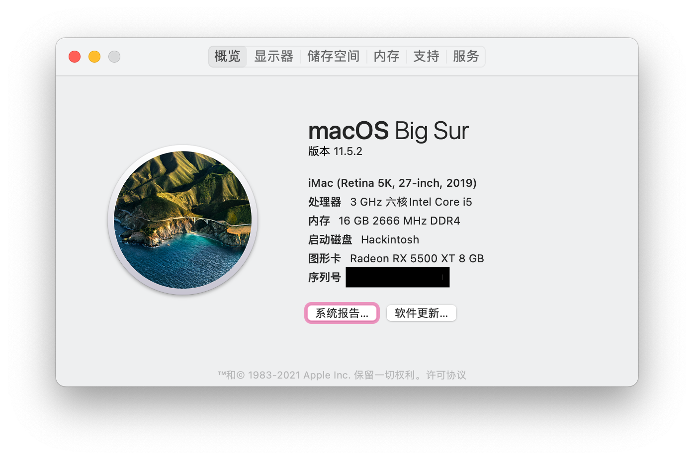
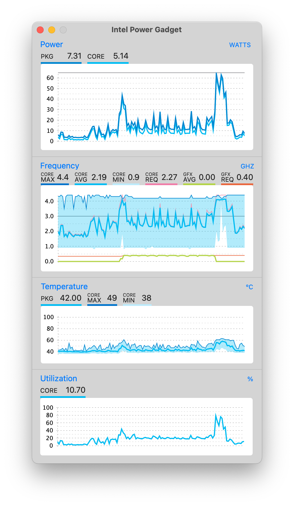
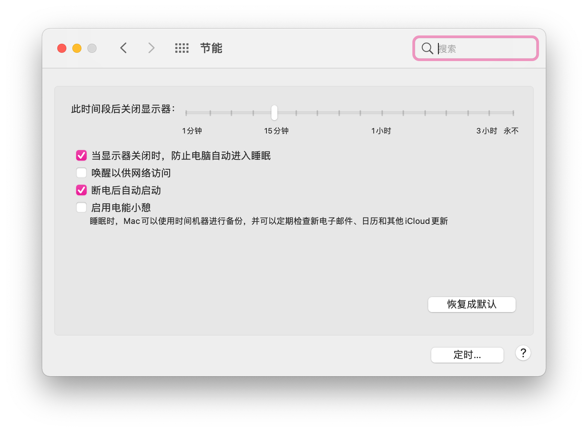
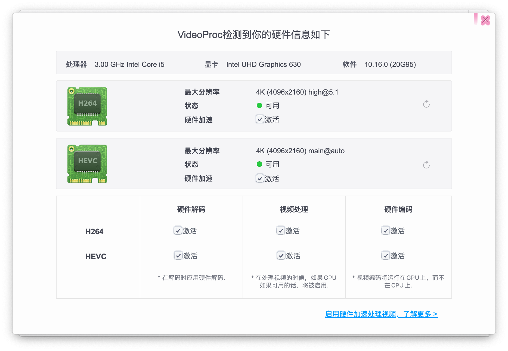
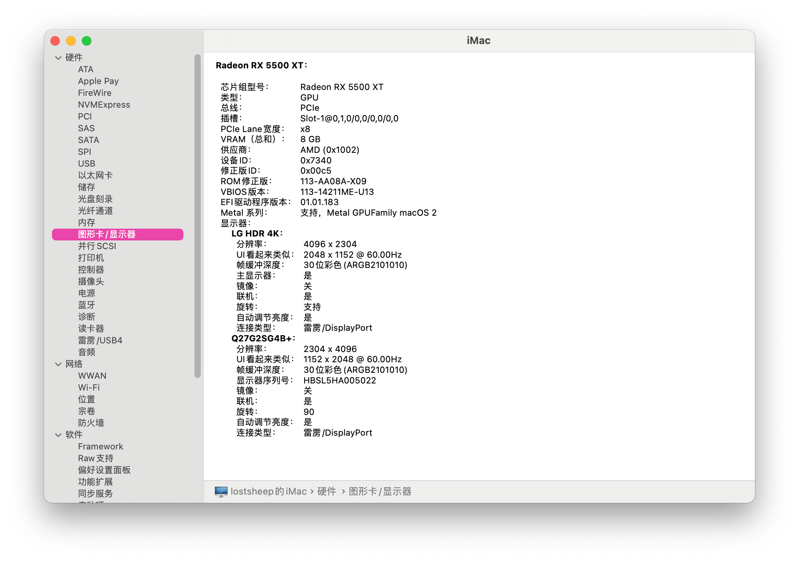
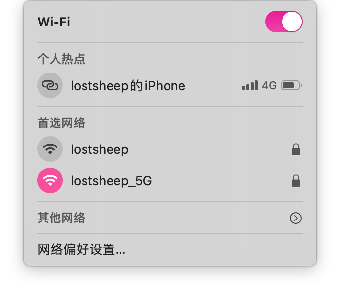
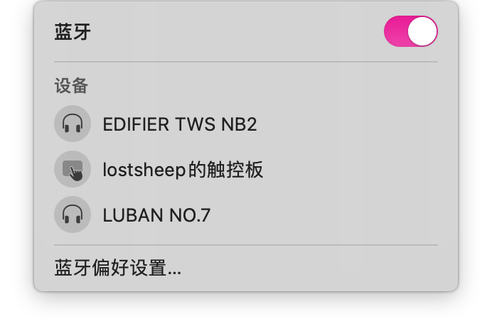
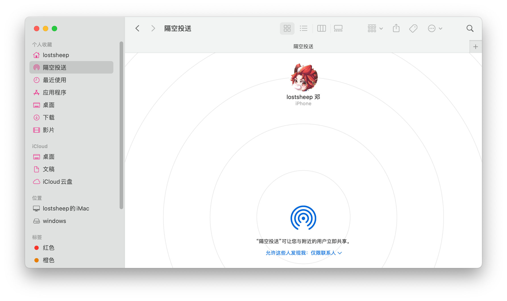
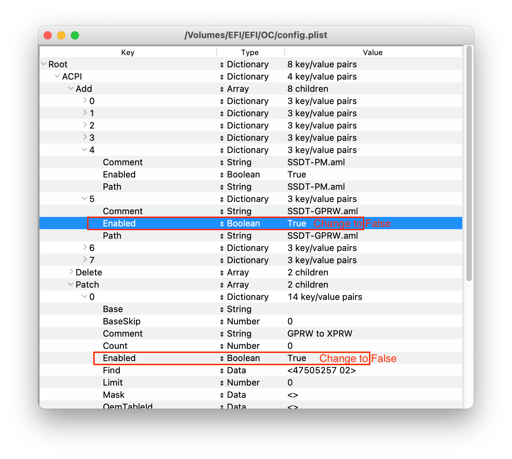
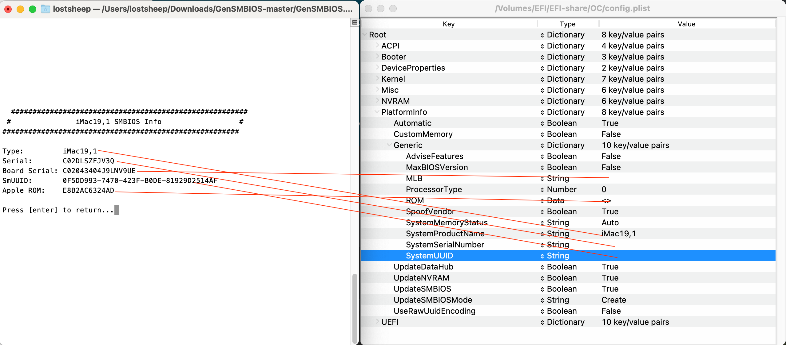

[TOC]

# Desktop PC Of Gigabyte B365

## List Of Device

| CPU          | Intel i5-9500               |
| :----------- | :-------------------------- |
| Matherboard  | Gigabyte B365M Arous Elite  |
| SSD          | WestData SN750 500G         |
| Graphic Card | DataLand Radeon RX5500XT 8G |
| Network Card | FV-T919(BCM94360CD)         |

## Key Feature

### CPU Turbo

### Native power management

### IGPU Hardware Acceleration

### EGPU Free Drive

### WIFI

### Bluetooth

### Airdrop

## Others Features

- [x] Sleep and wake up

  > I used `SSDT-GRPW.aml` to fix the wake up from sleep problem, it will shield the wakeup signal of keyboard and mouse, so you have to press the power button to wake up your hackintosh.
  >
  > If you don't like that, just disabled the `EFI/OC/ACPI/SSDT-GPRW.aml` and disabled the `Patch`, like this:
  >
  > 

- [x] AppleWatch unlock the screen

- [ ] Istat does't have the GPU RX5500XT temperature

- [x] 

## EFI Guide

### [Opencore 0.7.2 RELEASE](https://github.com/acidanthera/OpenCorePkg/releases/tag/0.7.2)

- > The best bootloader of the hackintosh at present!

### [Dortania's OpenCore Install Guide](https://dortania.github.io/OpenCore-Install-Guide/)

- > The most complete opencore install guide!

### [黑果小兵的部落阁](https://blog.daliansky.net/)

- > It's a very famous hackintosh tutorial website in china!

### [GenSMBIOS](https://github.com/corpnewt/GenSMBIOS)

- > I clean up the `Platforminfo` in the `EFI/OC/config.plist`, so you should generate your own `SMBIOS` info and copy-paste them into `EFI/OC/cofnig.plist`, like this : 

