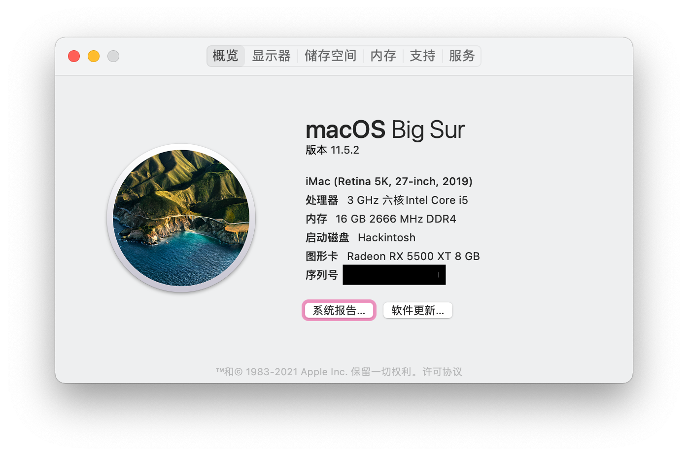
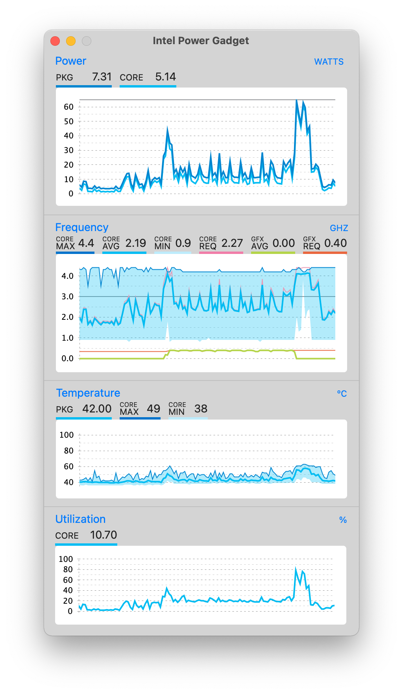
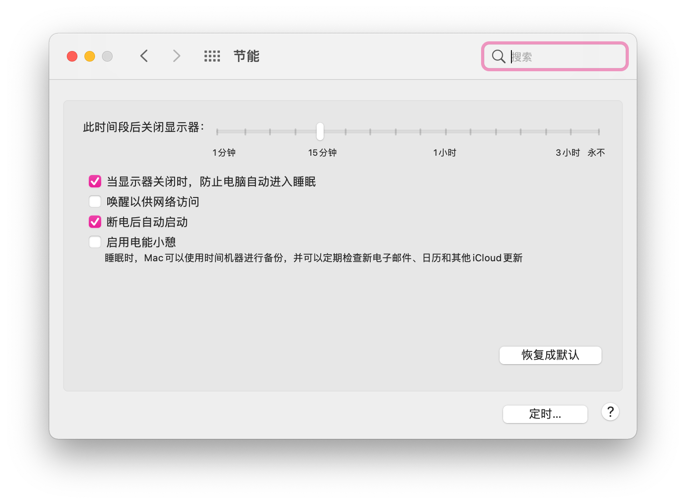
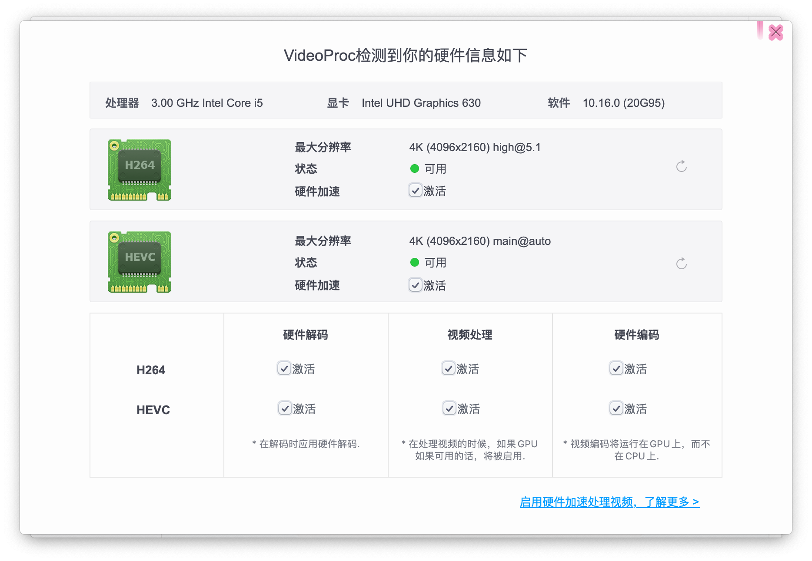
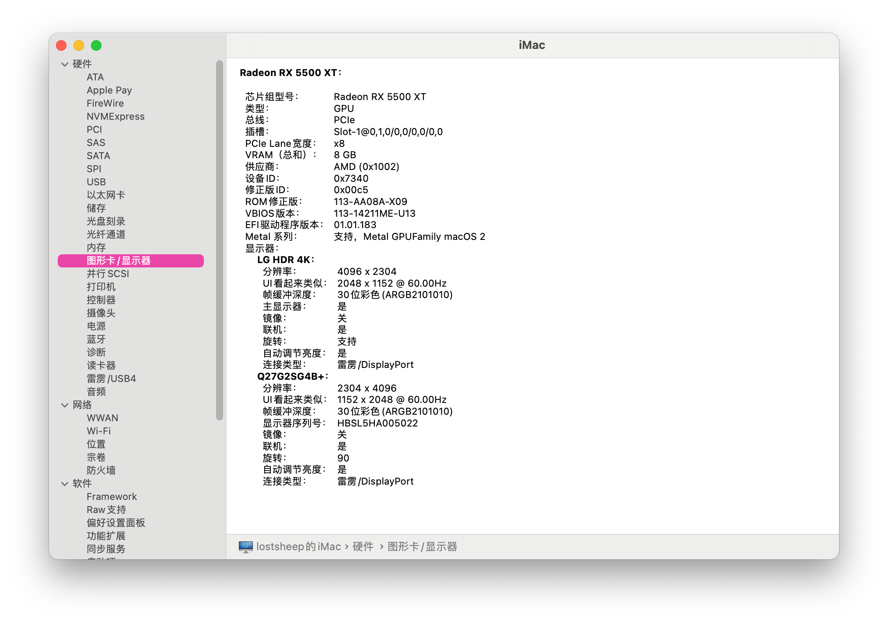
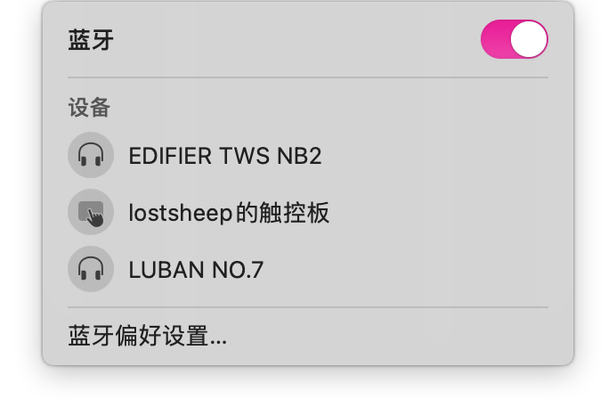
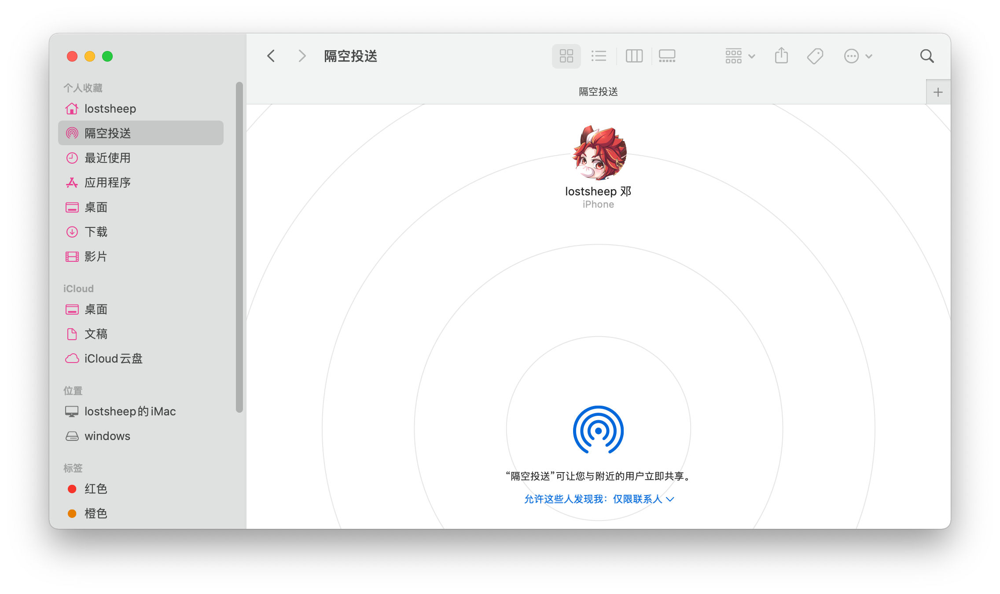

# Desktop PC Of Gigabyte B365

## List Of Device

|     CPU      |           i5-9500           |
| :----------: | :-------------------------: |
| Matherboard  | Gigabyte B365M Arous Elite  |
|     SSD      |     WestData SN750 500G     |
|   Graphic    | DataLand Radeon RX5500XT 8G |
| Network Card |     FV-T919(BCM94360CD)     |

## Key Feature

### CPU Turbo

### Native power management

### IGPU Hardware Acceleration

### EGPU Free Drive

### WIFI

### Bluetooth

### Airdrop

