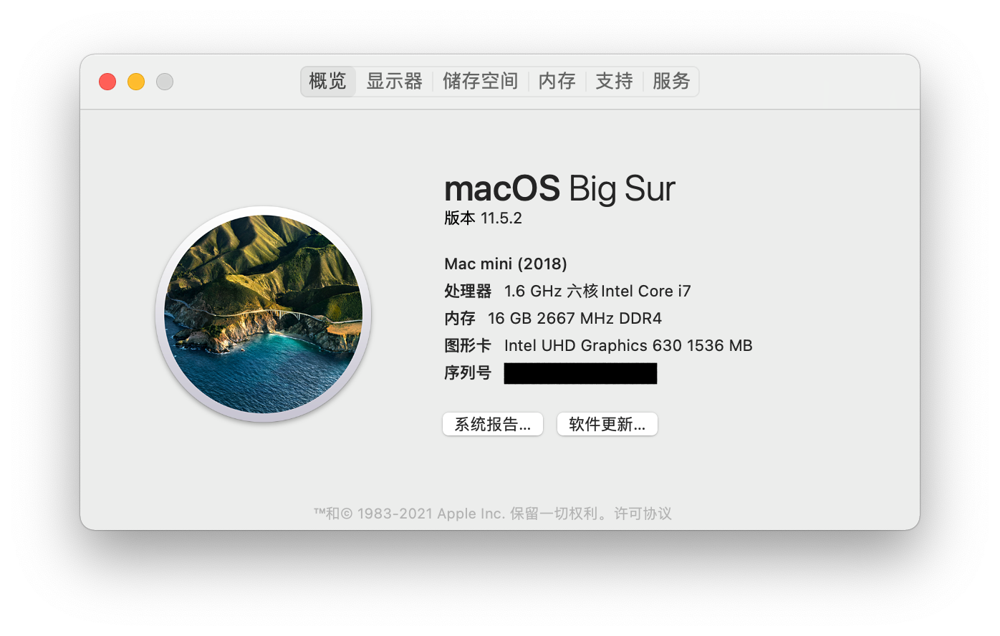
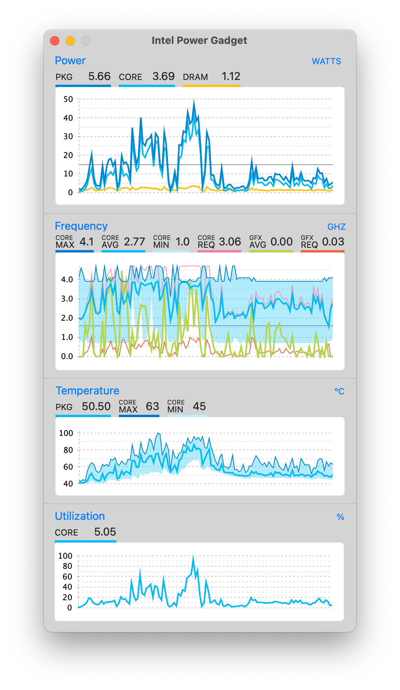
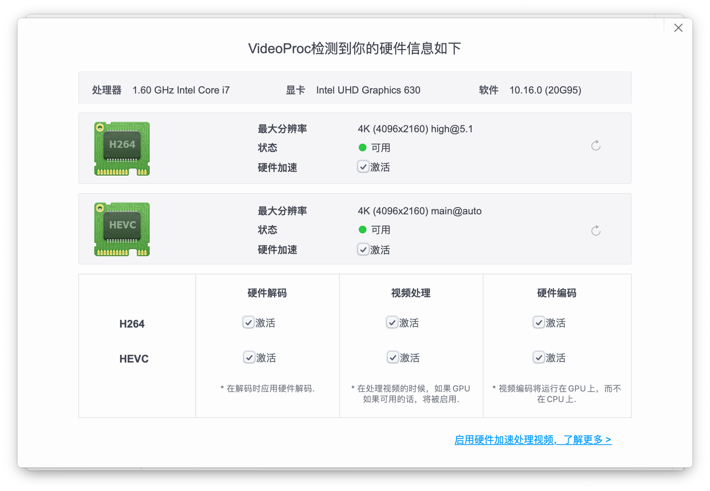
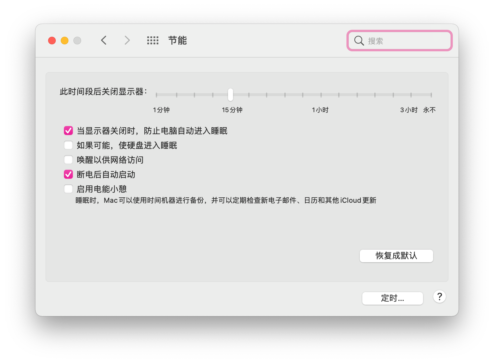
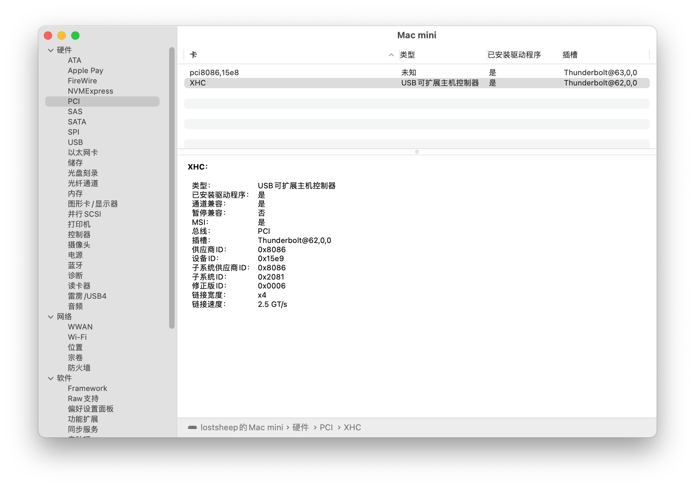
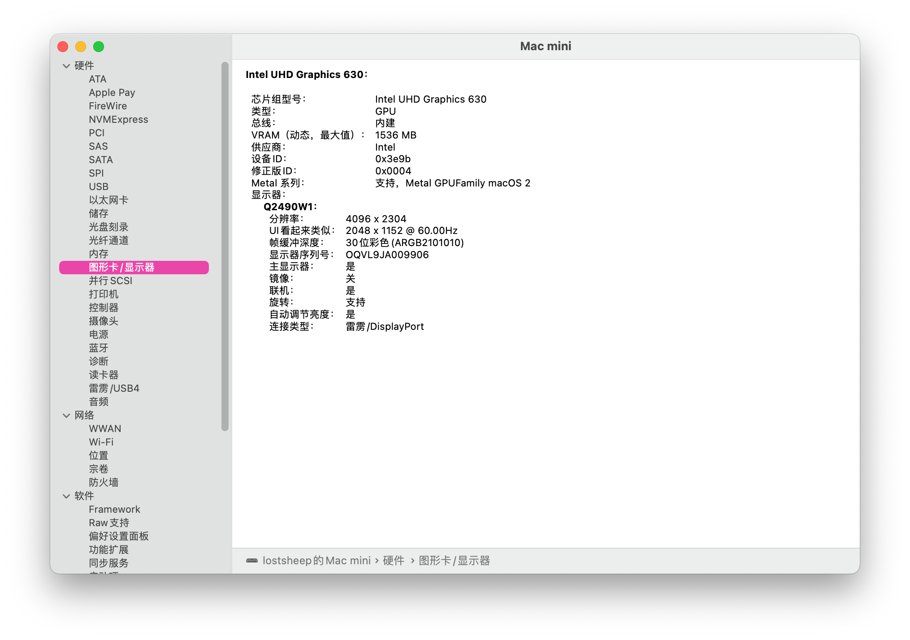
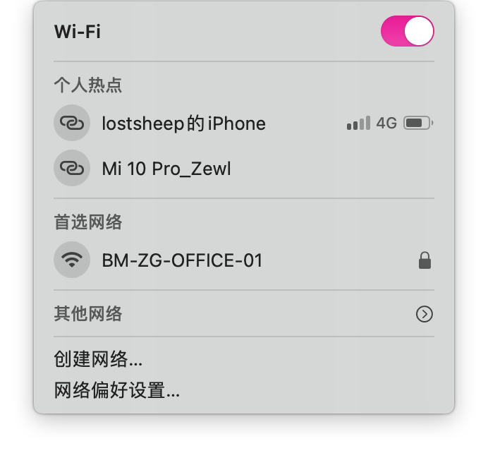
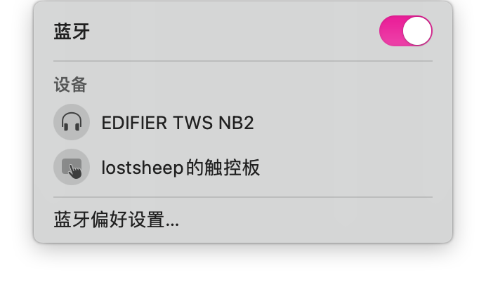
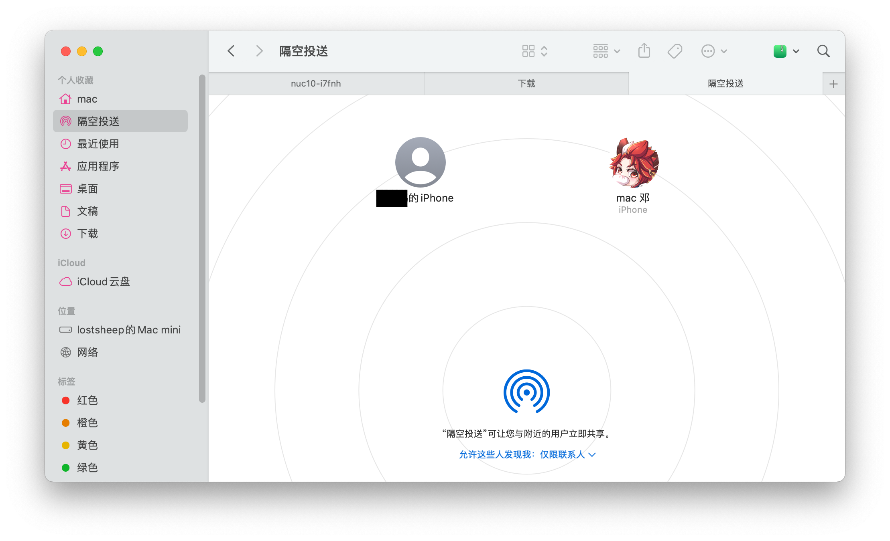
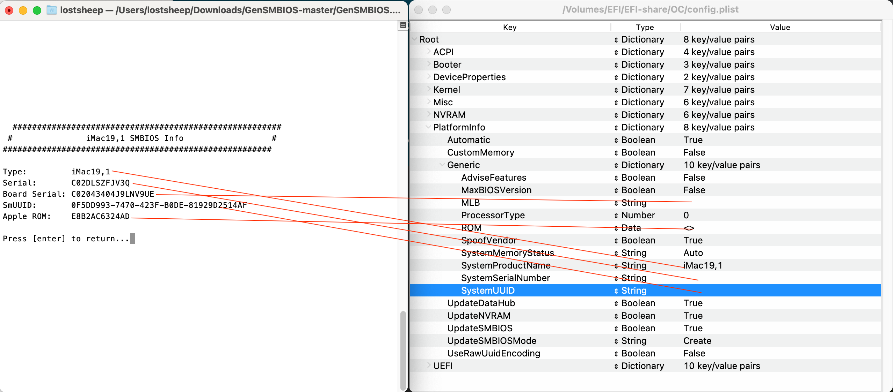

[TOC]

# NUC10 I7FNH

## List Of Device

| CPU          | Intel 10710U        |
| :----------- | :------------------ |
| SSD          | WestData SN750 500G |
| Graphic Card | Intel UHD 620(IGPU) |
| Network Card | BCM943602CS         |

## Key Features

### CPU Turbo

### IGPU Hareware Acceleration

### Native Power Management

### ThunderBolt

### IGPU Driver

### WIFI

### Bluetooth

### AirDrop

## Others Features

- [x] Sleep and wake up
- [x] AppleWatch unlock the screen
- [ ] Istat does't have the IGPU temperature

## EFI Guide

### [Opencore 0.7.2 RELEASE](https://github.com/acidanthera/OpenCorePkg/releases/tag/0.7.2)

- > The best bootloader of the hackintosh at present!

### [Dortania's OpenCore Install Guide](https://dortania.github.io/OpenCore-Install-Guide/)

- > The most complete opencore install guide!

### [黑果小兵的部落阁](https://blog.daliansky.net/)

- > It's a very famous hackintosh tutorial website in china!

### [Thunderbolt Driver Guide For NUC](https://osy.gitbook.io/hac-mini-guide/details/thunderbolt-3-fix)

- > The most beginner-friendly tutorial for NUC's thunderbolt!

### [GenSMBIOS](https://github.com/corpnewt/GenSMBIOS)

- > I clean up the `Platforminfo` in the `EFI/OC/config.plist`, so you should generate your own `SMBIOS` info and copy-paste them into `EFI/OC/cofnig.plist`, like this : 

